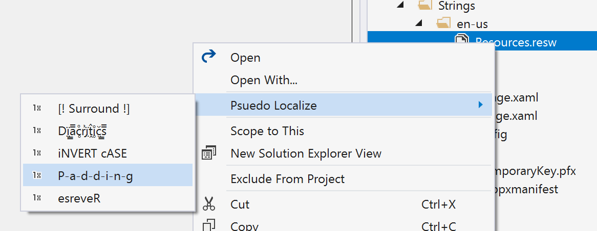

# Resource Pseudo-Localizer

Download the extension from the [VS Marketplace](https://marketplace.visualstudio.com/items?itemName=MattLaceyLtd.ResPseudoLoc)
or get the
[CI build](http://vsixgallery.com/extension/ResPsuedoLoc.fb9c5e68-fb3b-44f4-9412-717109dc3ba9/)

A Visual Studio extention that provides a quick way to check that all string resources are localized by "pseudo-localizing" them.

If you don't speak another language it can be tricky to verify that all UI string resources are localized correctly, this tool provides a quick way to modify all the resources so that when running the app it should be easy to recognize anything that hasn't been localized.

It works with RESX and RESW files. Right click on the resource file and select the option you want. All the entries in the file will then be modified accordingly.

Options can be combined and toggled by repeating the action.

See the [change log](CHANGELOG.md) for changes and road map.
